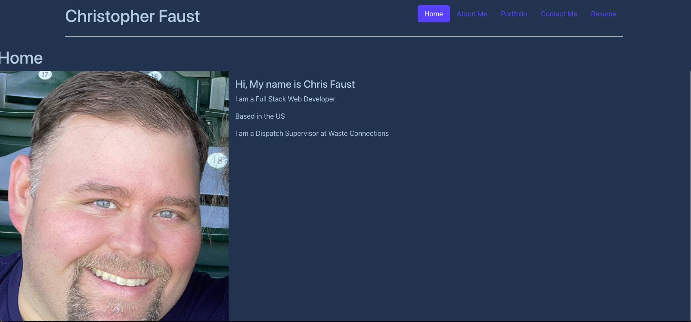

# React Portfolio

## Description
I am creating this Portfolio to show potential employers a single page application with working examples
so they can assess whether I'm a good candidate for an open position.

## Things I included in this app
1. When the user loads the page. They are presented with a page containing a header, a section for content, and a footer.
2. When the user views the header. They are presented with the developer's name and navigation with titles corresponding to
the different sections of the portfolio.
3. When the user views the navigation. They are presented with the titles Home, About Me, Portfolio, Contact Me, and Resume.
The title of the corresponding section will be highlighted.
4. When the user clicks on a title. They are present with the corresponding section below the navigation without the page 
reloading and the title is highlighted.
5. When the user loads the page for the first time. They are presented with the Home section.
6. The home section will have a recent photo and a welcome message describing myself.
7. The about me section will provide a short bio of myself
8. When the user selects the Portfolio section. they will see 6 of the developer's applications with links to both the deployed
applications and the corresponding GitHub repositories.
9. When the user is presented with the Contact Me section. They are presented with a form with a name, email, and message field.
When the user trys to submit the form without all the correct information they will be notified that it needs the correct information.
10. When the user navigates to the Resume section. They are presented the option to download a Resume.
11. When the user views the footer.  They are presented with links to the developer's GitHub profile, and the Linkedin Profile.

[Link to working Application](https://cefaust.github.io/react-portfolio/)  
[GitHub Repository](https://github.com/cefaust/react-portfolio)

